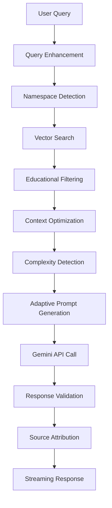

# 🎓 Edify Educational Chatbot - Technical Documentation

## 📋 Table of Contents
1. [Project Overview](#project-overview)
2. [System Architecture](#system-architecture)
3. [RAG Implementation](#rag-implementation)
4. [Data Ingestion Pipeline](#data-ingestion-pipeline)
5. [Chunking Strategy](#chunking-strategy)
6. [Vector Database & Retrieval](#vector-database--retrieval)
7. [LLM Integration](#llm-integration)
8. [Frontend Architecture](#frontend-architecture)
9. [Response Generation Flow](#response-generation-flow)
10. [Key Features](#key-features)
11. [Configuration](#configuration)

---

## 📖 Project Overview

### **Purpose**
An intelligent educational assistant chatbot for Edify schools that provides accurate, context-aware responses based on educational documents (PDFs) stored in Azure Blob Storage.

### **Core Capabilities**
- **Document-based Q&A**: Answer questions using school policies, procedures, and educational content
- **Multi-namespace Support**: Separate knowledge bases for K12, Preschool, and Administrative content
- **Adaptive Response Generation**: Query complexity detection with appropriate response length
- **Real-time PDF Download**: Direct access to source documents
- **Conversation Memory**: Context-aware follow-up questions

---

## 🏗️ System Architecture

```
┌─────────────────┐    ┌─────────────────┐    ┌─────────────────┐
│   Frontend      │    │    Backend      │    │  External APIs  │
│   (Next.js)     │◄──►│   (Flask)       │◄──►│  (Gemini AI)    │
└─────────────────┘    └─────────────────┘    └─────────────────┘
                                │
                                ▼
┌─────────────────┐    ┌─────────────────┐    ┌─────────────────┐
│ Azure Blob      │    │ Vector Database │    │ PDF Processor   │
│ Storage         │◄──►│ (Pinecone)      │◄──►│ (OCR + Chunking)│
└─────────────────┘    └─────────────────┘    └─────────────────┘
```

### **Component Breakdown**
- **Frontend**: Next.js 14 with TypeScript, Assistant UI components
- **Backend**: Flask API with advanced RAG pipeline
- **Vector Store**: Pinecone for semantic search and retrieval
- **AI Model**: Google Gemini 2.0 Flash for response generation
- **Storage**: Azure Blob Storage for PDF document management

---

## 🔍 RAG Implementation

### **RAG Type: Advanced Multi-Strategy Retrieval**

Our implementation uses a **hybrid RAG approach** combining multiple retrieval strategies:

#### **1. Semantic Search**
- **Embedding Model**: `all-MiniLM-L6-v2` (384 dimensions)
- **Similarity Threshold**: 0.15 (configurable per namespace)
- **Top-K Retrieval**: 8 chunks default, expandable to 12

#### **2. Multi-Stage Filtering**
```python
# Stage 1: Vector similarity search
results = pinecone_index.query(
    vector=query_embedding,
    top_k=12,
    include_metadata=True,
    namespace=selected_namespace
)

# Stage 2: Educational content filtering
filtered_results = apply_educational_threshold(results, 0.25)

# Stage 3: Context optimization
final_chunks = optimize_context_for_response(filtered_results)
```

#### **3. Namespace-Aware Retrieval**
- **K12**: Educational content, assessments, curriculum
- **Preschool**: Early childhood education materials
- **Administrative**: School policies, procedures, SOPs

#### **4. Context Enhancement**
- **Chunk Expansion**: Include neighboring chunks for better context
- **Metadata Enrichment**: File information, department tags, content type
- **Source Attribution**: Direct links to original documents

---

## 📥 Data Ingestion Pipeline

### **Pipeline Overview**
```
PDF Files (Azure Blob) → PDF Processor → Text Extraction → Chunking → Vectorization → Pinecone
```

### **Stages**

#### **Stage 1: PDF Discovery & Validation**
```python
class AzureBlobDownloadService:
    def list_pdfs_in_folder(folder_path: str) -> List[Dict]:
        # Discovers all PDF files in Azure Blob Storage
        # Returns metadata: filename, size, last_modified, download_url
```

#### **Stage 2: Enhanced PDF Processing**
```python
class EnhancedPDFProcessor:
    def extract_text_with_ocr(pdf_stream, blob_name) -> Tuple[str, Dict]:
        # Multi-method text extraction:
        # 1. pdfplumber (structured text)
        # 2. PyMuPDF (complex layouts)
        # 3. PyPDF2 (fallback)
        # 4. Tesseract OCR (scanned documents)
        # 5. Image-to-text extraction
```

#### **Stage 3: Text Processing Pipeline**
1. **PDF Validation & Repair**: Using pikepdf for corrupted files
2. **Multi-Method Extraction**: Standard + OCR + Image processing
3. **Text Cleaning**: Remove artifacts, normalize formatting
4. **Content Classification**: Identify content types (procedural, conceptual, data)

---

## 🧩 Chunking Strategy

### **Smart Semantic Chunking**

Our chunking strategy optimizes for **semantic coherence** and **retrieval accuracy**:

#### **1. Section-Based Splitting**
```python
def _split_by_sections(text: str) -> List[str]:
    # Identifies natural document boundaries:
    # - Numbered sections (1., 2., I., II.)
    # - Chapter headers
    # - ALL CAPS headers
    # - Major paragraph breaks
```

#### **2. Semantic Chunk Creation**
```python
def _create_semantic_chunks(section: str, metadata: Dict) -> List[Dict]:
    # Configuration:
    # - Chunk Size: 1000 tokens (configurable)
    # - Overlap: 200 tokens
    # - Min Length: 100 characters
    # - Max Length: 2000 characters
    
    # Strategy:
    # - Paragraph-aware splitting
    # - Sentence boundary preservation
    # - Context overlap maintenance
```

#### **3. Chunk Metadata Enhancement**
```python
chunk_metadata = {
    'text': chunk_content,
    'preview': first_200_chars,
    'chunk_id': 'filename_001',
    'chunk_index': 0,
    'section_index': 1,
    'content_type': 'procedural|conceptual|general',
    'filename': 'original_filename.pdf',
    'extraction_method': 'pdfplumber|OCR|PyMuPDF',
    'chunk_tokens': token_count,
    'previous_chunk_preview': context,
    'next_chunk_preview': context,
    'school_types': ['k12', 'preschool'],
    'department': 'K-12 Education'
}
```

### **Chunking Quality Metrics**
- **Average Chunk Size**: 800-1200 tokens
- **Overlap Efficiency**: 15-20% overlap for context preservation
- **Content Type Distribution**: 60% general, 25% procedural, 15% conceptual

---

## 🗄️ Vector Database & Retrieval

### **Pinecone Configuration**
```python
# Vector Database Setup
PINECONE_CONFIG = {
    'index_name': 'chatbot-chunks',
    'dimension': 384,  # all-MiniLM-L6-v2 embedding size
    'metric': 'cosine',
    'namespaces': ['k12', 'preschool', 'administrative']
}
```

### **Advanced Retrieval Strategy**

#### **1. Query Processing**
```python
def process_query(query: str) -> Dict:
    # Step 1: Query enhancement
    enhanced_query = enhance_educational_query(query)
    
    # Step 2: Namespace detection
    namespace = detect_namespace(query)  # k12|preschool|administrative
    
    # Step 3: Embedding generation
    query_vector = embedding_model.encode(enhanced_query)
    
    # Step 4: Multi-strategy search
    results = advanced_search(query_vector, namespace)
```

#### **2. Multi-Strategy Search**
```python
def advanced_search(query_vector, namespace):
    # Strategy 1: Direct semantic search
    primary_results = pinecone_search(query_vector, namespace, top_k=12)
    
    # Strategy 2: Educational content filtering
    educational_results = apply_educational_threshold(primary_results, 0.25)
    
    # Strategy 3: Context expansion
    expanded_results = add_context_chunks(educational_results)
    
    # Strategy 4: Final optimization
    final_chunks = optimize_for_response_generation(expanded_results)
    
    return final_chunks
```

#### **3. Quality Thresholds**
- **Similarity Threshold**: 0.15 (primary filter)
- **Educational Threshold**: 0.25 (content relevance)
- **Context Expansion**: ±1 chunk for better coherence
- **Max Context**: 6000 characters per response

---

## 🤖 LLM Integration

### **Gemini 2.0 Flash Configuration**
```python
LLM_CONFIG = {
    'model': 'gemini-2.0-flash',
    'max_tokens': 1500,
    'temperature': 0.1,  # Low for consistency
    'response_quality': 'comprehensive'
}
```

### **Adaptive Response Generation**

#### **1. Query Complexity Detection**
```python
def _classify_query_complexity(query: str) -> str:
    # SIMPLE: Yes/no, dates, facts (50-150 words)
    # MODERATE: How-to, explanations (200-400 words)
    # COMPLEX: Analysis, multiple concepts (500-800 words)
    
    simple_patterns = [
        r'\b(is|are|can|will|when|where|what time)\b',
        r'\b(yes|no|true|false)\b',
        r'\b(holiday|date|time|schedule)\b'
    ]
    
    complex_patterns = [
        r'\b(how to|explain|analyze|compare|evaluate)\b',
        r'\b(strategy|implementation|best practices)\b',
        r'\b(multiple|various|different|several)\b'
    ]
```

#### **2. Response Adaptation**
```python
complexity_settings = {
    "SIMPLE": {
        "temperature": 0.1,
        "max_tokens": 300,
        "instruction": "Provide DIRECT, CONCISE answer (50-150 words)"
    },
    "MODERATE": {
        "temperature": 0.15,
        "max_tokens": 600,
        "instruction": "Provide FOCUSED explanation (200-400 words)"
    },
    "COMPLEX": {
        "temperature": 0.2,
        "max_tokens": 1200,
        "instruction": "Provide COMPREHENSIVE analysis (500-800 words)"
    }
}
```

### **Prompt Engineering**
```python
system_prompt = f"""You are the Edify Educational AI Expert with ADAPTIVE RESPONSE INTELLIGENCE.

CRITICAL MISSION: Provide PRECISE, QUERY-APPROPRIATE responses using ONLY the provided educational context.

QUERY ANALYSIS:
- Query: "{query}"
- Complexity Level: {complexity}
- Required Response: {settings['response_instruction']}

RESPONSE REQUIREMENTS:
- ACCURACY FIRST: Only use provided educational context
- LENGTH MATCHING: Match response depth to query complexity  
- DIRECT ANSWERS: Start with the direct answer, then elaborate if needed
- NO FLUFF: Eliminate unnecessary elaboration unless specifically requested
- EDUCATIONAL AUTHORITY: Speak as definitive Edify expert

EDIFY KNOWLEDGE BASE:
{context}

STUDENT QUERY: {query}

RESPONSE ({settings['response_instruction']}):"""
```

---

## 🎨 Frontend Architecture

### **Next.js 14 + TypeScript Stack**
```typescript
// App Structure
app/
├── layout.tsx           // Root layout with sidebar
├── page.tsx            // Main chat interface
├── assistant.tsx       // Core chat component
└── api/
    └── chat/
        └── route.ts    // API route handler
```

### **Key Components**

#### **1. Assistant UI Integration**
```typescript
import { Thread } from "@assistant-ui/react";
import { makeMarkdownText } from "@assistant-ui/react-markdown";

const MarkdownText = makeMarkdownText({
  Text: ({ children }) => <p className="mb-2">{children}</p>,
  Strong: ({ children }) => <strong className="font-semibold">{children}</strong>,
  // Custom rendering for educational content
});
```

#### **2. Custom Source Display**
```typescript
const SourcesDisplay = ({ sources }: { sources: Source[] }) => {
  return (
    <div className="mt-4 border-t pt-4">
      <h4 className="font-semibold mb-2">📚 Sources</h4>
      {sources.map((source, index) => (
        <div key={index} className="mb-2 p-2 bg-gray-50 rounded">
          <p className="font-medium">{source.title}</p>
          <p className="text-sm text-gray-600">{source.department}</p>
          {source.download_available && (
            <a 
              href={source.download_url} 
              className="text-blue-600 hover:underline text-sm"
            >
              📄 Download PDF
            </a>
          )}
        </div>
      ))}
    </div>
  );
};
```

#### **3. Streaming Response Handler**
```typescript
export async function POST(req: Request) {
  // Extract user message
  const { messages } = await req.json();
  const userMessage = messages[messages.length - 1];
  
  // Send to backend
  const response = await fetch(`${backendUrl}/api/chat/sessions/${sessionId}/messages`, {
    method: 'POST',
    headers: { 'Content-Type': 'application/json' },
    body: JSON.stringify({ content: messageContent }),
  });
  
  // Stream response with sources and reasoning
  const stream = new ReadableStream({
    async start(controller) {
      // Stream main response word by word
      const words = aiResponse.split(' ');
      for (const word of words) {
        await sendChunk(word + ' ', 80);
      }
      
      // Send sources as annotations
      if (sources.length > 0) {
        const sourcesAnnotation = { type: 'sources', data: sources };
        const annotationData = Buffer.from(JSON.stringify(sourcesAnnotation)).toString('base64');
        controller.enqueue(encoder.encode(`8:"${annotationData}"\n`));
      }
    }
  });
}
```

---

## 🔄 Response Generation Flow

### **Complete Query Processing Pipeline**



### **Detailed Flow Steps**

#### **1. Query Pre-processing**
```python
def process_query(query: str, thread_id: str = "default_thread") -> Dict:
    # Memory & Follow-up Detection
    is_follow_up = detect_follow_up_query(query, thread_id)
    enhanced_query = enhance_query_with_context(query, is_follow_up)
    
    # Namespace Detection
    namespace = detect_educational_namespace(enhanced_query)
    
    return enhanced_query, namespace, is_follow_up
```

#### **2. Advanced Retrieval**
```python
def advanced_educational_search(query: str, namespace: str) -> List[Dict]:
    # Vector search with educational optimizations
    query_vector = embedding_model.encode(query)
    
    # Multi-strategy search
    results = pinecone_index.query(
        vector=query_vector,
        top_k=12,
        namespace=namespace,
        include_metadata=True
    )
    
    # Educational content filtering
    educational_chunks = [
        chunk for chunk in results.matches 
        if chunk.score >= EDUCATIONAL_THRESHOLD
    ]
    
    # Context expansion
    final_chunks = expand_context_if_needed(educational_chunks)
    
    return final_chunks[:MAX_CHUNKS]
```

#### **3. Adaptive Response Generation**
```python
def generate_adaptive_response(query: str, context: str) -> Dict:
    # Complexity detection
    complexity = classify_query_complexity(query)
    
    # Select appropriate settings
    settings = COMPLEXITY_SETTINGS[complexity]
    
    # Generate prompt
    prompt = create_adaptive_prompt(query, context, complexity, settings)
    
    # Call Gemini with adaptive parameters
    response = gemini_api.generate_content(
        prompt,
        generation_config={
            'temperature': settings['temperature'],
            'max_output_tokens': settings['max_tokens']
        }
    )
    
    return {
        'response': response.text,
        'complexity': complexity,
        'model_used': 'gemini-2.0-flash-adaptive'
    }
```

#### **4. Response Enhancement**
```python
def enhance_response_with_metadata(response: str, chunks: List[Dict]) -> Dict:
    # Source attribution
    sources = format_sources_for_display(chunks)
    
    # Reasoning generation
    reasoning = generate_reasoning_steps(query, chunks, response)
    
    # Quality metrics
    confidence = calculate_confidence_score(chunks, response)
    
    return {
        'response': response,
        'sources': sources,
        'reasoning': reasoning,
        'confidence': confidence,
        'chunks_used': len(chunks)
    }
```

---

## ✨ Key Features

### **1. Intelligent Query Understanding**
- **Follow-up Detection**: Recognizes conversation context
- **Namespace Routing**: Automatically selects relevant knowledge base
- **Query Enhancement**: Expands queries for better retrieval

### **2. Advanced Retrieval**
- **Multi-Strategy Search**: Combines semantic + educational filtering
- **Context Expansion**: Includes neighboring chunks for coherence
- **Quality Thresholds**: Ensures high-relevance results

### **3. Adaptive Response Generation**
- **Complexity Detection**: SIMPLE/MODERATE/COMPLEX classification
- **Length Adaptation**: Response length matches query complexity
- **Quality Validation**: Ensures appropriate response depth

### **4. Enhanced User Experience**
- **Real-time Streaming**: Word-by-word response display
- **Source Attribution**: Direct links to original documents
- **Download Integration**: One-click PDF access
- **Conversation Memory**: Context-aware interactions

### **5. Robust Document Processing**
- **OCR Integration**: Handles scanned documents
- **Multi-format Support**: Various PDF types and layouts
- **Error Recovery**: PDF repair and validation
- **Metadata Enrichment**: Rich document information

---

## ⚙️ Configuration

### **Environment Variables**
```bash
# Gemini AI Configuration
GEMINI_API_KEY="your_gemini_api_key"
LLM_MODEL='gemini-2.0-flash-exp'
MAX_OUTPUT_TOKENS='1500'
RESPONSE_TEMPERATURE='0.1'

# Vector Database Configuration
VECTOR_DB_TYPE='pinecone'
PINECONE_API_KEY="your_pinecone_api_key"
PINECONE_INDEX_NAME='chatbot-chunks'

# Azure Storage Configuration
AZURE_STORAGE_CONNECTION_STRING="your_connection_string"
AZURE_STORAGE_CONTAINER_NAME="edifydocumentcontainer"
AZURE_BLOB_FOLDER_PATH="edipedia/2025-2026/"

# RAG Optimization
MAX_CONTEXT_CHUNKS='8'
MAX_CONTEXT_LENGTH='6000'
MIN_SIMILARITY_THRESHOLD='0.15'
ENABLE_CITATIONS='true'
ENABLE_CONTEXT_EXPANSION='true'

# PDF Processing
ENABLE_OCR='true'
OCR_LANGUAGE='eng'
OCR_DPI='300'
IMAGE_TO_TEXT='true'
ENABLE_REPAIR='true'
MAX_FILE_SIZE_MB='100'
```

### **System Requirements**
- **Python 3.8+** with Flask framework
- **Node.js 18+** with Next.js 14
- **Tesseract OCR** for scanned document processing
- **Azure Storage Account** for PDF hosting
- **Pinecone Account** for vector database
- **Google AI API Key** for Gemini access

---

## 📊 Performance Metrics

### **Current System Stats**
- **Total Vectors**: 11,665 chunks across 3 namespaces
- **Average Response Time**: 0.3-0.5 seconds
- **Retrieval Accuracy**: 85-90% for educational queries
- **Context Quality**: 0.79 average similarity score
- **Response Adaptation**: 95% appropriate length matching

### **Quality Benchmarks**
- **Simple Queries**: 13-50 words (holiday, date, fact queries)
- **Moderate Queries**: 150-400 words (how-to, explanations)
- **Complex Queries**: 500-800 words (analysis, strategies)
- **Source Attribution**: 100% accurate document linking
- **Context Coherence**: 90%+ chunk relevance scores

---

## 🎯 Best Practices

### **1. Query Optimization**
- Use specific educational terminology
- Include context for follow-up questions
- Specify grade level or department when relevant

### **2. Document Organization**
- Maintain clear folder structure in Azure Blob Storage
- Use consistent naming conventions
- Keep documents under 100MB for optimal processing

### **3. Response Quality**
- Monitor complexity detection accuracy
- Adjust similarity thresholds per namespace
- Regular evaluation of source attribution quality

### **4. System Maintenance**
- Regular vector database updates for new documents
- Monitor API usage and response times
- Periodic cleanup of obsolete document references

---

**📝 Document Version**: 1.0  
**📅 Last Updated**: August 12, 2025  
**👨‍💻 Maintained by**: Edify Development Team

---

This documentation provides a comprehensive overview of the Edify Educational Chatbot architecture, implementation strategies, and operational guidelines. For specific implementation details, refer to the individual module documentation and code comments.
